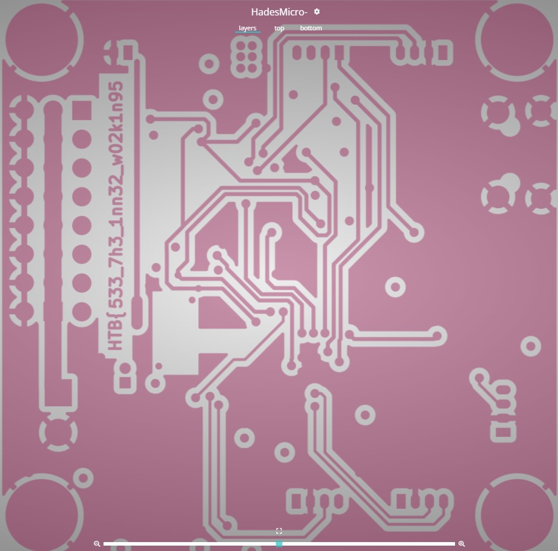
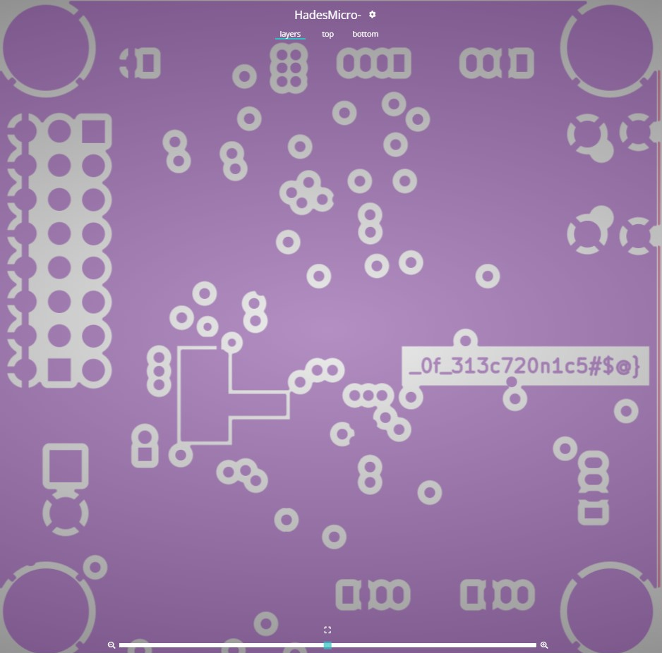

# Critical Flight

## Description

Your team has assigned you to a mission to investigate the production files of Printed Circuit Boards for irregularities. This is in response to the deployment of nonfunctional DIY drones that keep falling out of the sky. The team had used a slightly modified version of an open-source flight controller in order to save time, but it appears that someone had sabotaged the design before production. Can you help identify any suspicious alterations made to the boards

## Solution

The challenge was providing the following files:

```
.
|-- HadesMicro-B_Cu.gbr
|-- HadesMicro-B_Fab.gbr
|-- HadesMicro-B_Mask.gbr
|-- HadesMicro-B_Paste.gbr
|-- HadesMicro-B_Silkscreen.gbr
|-- HadesMicro-Edge_Cuts.gbr
|-- HadesMicro-F_Cu.gbr
|-- HadesMicro-F_Fab.gbr
|-- HadesMicro-F_Mask.gbr
|-- HadesMicro-F_Paste.gbr
|-- HadesMicro-F_Silkscreen.gbr
|-- HadesMicro-In1_Cu.gbr
`-- HadesMicro-In2_Cu.gbr
```

The **.gbr** format is a Gerber file that stores printed circuit board designs.
So, I dug up [this](https://www.pcbway.com/project/OnlineGerberViewer.html) Gerber Viewer tool.

By examining and isolating the layers in the layers view, you can find the two parts of the flag. The first one is on the **bottom copper** layer and the second is on the **inner copper** layer, as observed in the images below.




## Flag

```
HTB{553_7h3_1nn32_w02k1n95_0f_313c720n1c5#$@}
```