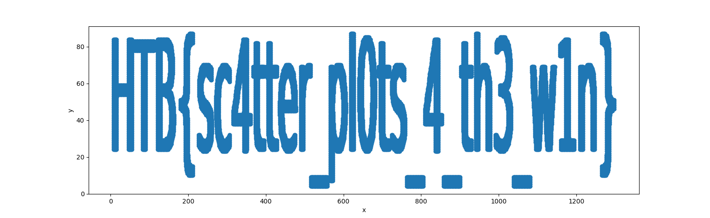

# Reconfiguration

## Description

As Pandora set out on her quest to find the ancient alien relic, she knew that the journey would be treacherous. The desert was vast and unforgiving, and the harsh conditions would pu ther cyborg body to the test. Pandora started by collecting data abou the temperature and humidity levels in the desert. She used a scatter plot in Orange Workspace file to visualize this data and indetified the areas where the temperature was highest and the mudiity was lowest. Using this information, she reconfigured her sensors to better withstand the extreme heat and conserve water. But, a second look at the data revealed something otherworldy, it seems that the relic's presence beneath the surface has scarred the land in a very peculiar way, can you see it?

## Solution

Ok this solution is just plotting a Scatterplot with the **points.csv** file given. I didn't do that in the beginning though, I was baited by the .ows (Orange project file).

```python
import pandas as pd
import matplotlib.pyplot as plt

data = pd.read_csv('points.csv', header=None)
x = data[0]
y = data[1]

plt.scatter(x, y)
plt.xlabel('x')
plt.ylabel('y')
```



## Flag

```HTB{sc4tter_pl0ts_4_th3_w1n}```
